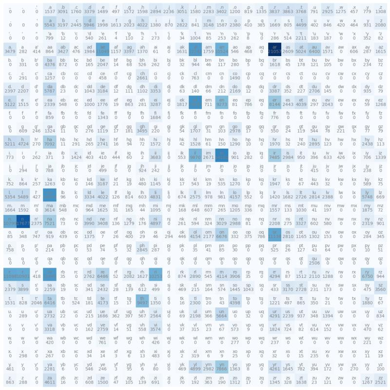

# Building a GPT-like LLM from Scratch w Pytorch

## [Step 1 - Experimenting with Text files](1._BigramModel.ipynb)

The model we will be using for this 1st section is called a [Bi-gram](https://web.stanford.edu/~jurafsky/slp3/3.pdf) model. Which is a type of Natural language processing (NLP) model that predicts a word based on the immediately preceding word.

Text file used is the book Wizard of OZ which you can download from Gutenberg library for free.
<br>Make sure to select "Plain Text UTF-8"
<br>https://www.gutenberg.org/ebooks/22566

```python
# Open/read text file "Wizard of OZ"
with open('data/wizard_of_oz.txt', 'r', encoding='utf=8') as file:
  text = file.read()
# print(text[:200])
# bring in all our uniqye text characters as a set and sort
chars = sorted(set(text))
print(chars)
print(len(chars)) # 81 unique character values in book/tet

OUTPUT:
81
['\n', ' ', '!', '"', '&', "'", '(', ')', '*', ',', '-', '.', '0', '1', '2', '3', '4', '5', '6', '7', '8', '9', ':', ';', '?', 'A', 'B', 'C', 'D', 'E', 'F', 'G', 'H', 'I', 'J', 'K', 'L', 'M', 'N', 'O', 'P', 'Q', 'R', 'S', 'T', 'U', 'V', 'W', 'X', 'Y', 'Z', '[', ']', '_', 'a', 'b', 'c', 'd', 'e', 'f', 'g', 'h', 'i', 'j', 'k', 'l', 'm', 'n', 'o', 'p', 'q', 'r', 's', 't', 'u', 'v', 'w', 'x', 'y', 'z', '\ufeff']


```

### Pytorch - Deep Learning framework used to train neural networks

Pytorch requires Nvidia GPU with CUDA enabled or use one free with [Google Colab](https://colab.research.google.com/)<br>
Download Pytorch - https://pytorch.org/get-started/locally/<br>
Enable GPU CUDA tensors if available for faster training times<br>
https://pytorch.org/tutorials/beginner/basics/intro.html

```python
# import Pytorch libs
import torch
import torch.nn as nn
from torch.nn import functional as F

# Check if GPU CUDA is enabled otherwise use CPU
device = 'cuda' if torch.cuda.is_available() else 'cpu'
print(device)

```

### Comparing speeds: Pytorch (GPU) vs Numpy (CPU) for multidimensional array computations

```python
# Speed Check - Pytorch (GPU) vs Numpy (CPU)
torch_rand1 = torch.rand(100, 100, 100, 100).to(device) # Torch tensor
torch_rand2 = torch.rand(100, 100, 100, 100).to(device)# Torch tensor
np_rand1 = torch.rand(100, 100, 100, 100) # Numpy array
np_rand2 = torch.rand(100, 100, 100, 100) # Numpy array

start_time = time.time()

rand = (torch_rand1 @ torch_rand2)

end_time = time.time()

elapsed_time = end_time - start_time
print(f'Pytorch CUDA: {elapsed_time:.8f}s')

start_time = time.time()

rand = np.multiply(np_rand1, np_rand2)
end_time = time.time()
elapsed_time = end_time - start_time
print(f'Numpy: {elapsed_time:.8f}s')

OUTPUT:
Pytorch CUDA: 0.00800133s
Numpy: 0.19042158s

```

### Tokenizing our text w Encoders and Decoders

After gathering all the unique characters in our text we will need to convert these values into tokens. For this we need Encoders and Decoders <br>
**Encoders**: Converts our text values into integers (makes it machine readable)<br>
**Decoders**: Converts our integers into text values (makes it human readable after our model completes it's training)

https://www.datacamp.com/blog/what-is-tokenization#:~:text=Imagine%20you%27re%20trying,the%20two%20contexts.

```python
# Encoder and Decoder logic
string_to_int = { ch:i for i, ch in enumerate(chars) }
int_to_string = { i:ch for i, ch in enumerate(chars) }
encode = lambda s: [string_to_int[c] for c in s]
decode = lambda l: ''.join([int_to_string[i] for i in l])

# encoded_hello = encode('hello')
# decoded_hello = decode(encoded_hello)
# print(f'Encoded hello =', encoded_hello)
# print(f'Decoded hello =', decoded_hello)

data = torch.tensor(encode(text), dtype=torch.long)
print(data[:100])


OUTPUT:
tensor([78,  1,  1, 27, 38, 41, 38, 43, 31, 47,  1, 24, 37, 27,  1, 43, 31, 28,
         1, 46, 32, 48, 24, 41, 27,  1, 38, 29,  1, 38, 48,  0,  0,  1,  1, 25,
        47,  0,  0,  1,  1, 35, 10,  1, 29, 41, 24, 37, 34,  1, 25, 24, 44, 36,
         0,  0,  1,  1, 24, 44, 43, 31, 38, 41,  1, 38, 29,  1, 43, 31, 28,  1,
        46, 32, 48, 24, 41, 27,  1, 38, 29,  1, 38, 48,  8,  1, 43, 31, 28,  1,
        35, 24, 37, 27,  1, 38, 29,  1, 38, 48])


```

### Grouping our characters now integers into block sizes then chunking our blocks into batch sizes

After converting our text characters into integers we want to group our values into blocks then we group these blocks into batch sizes
Think of blocks as words and batches as multiple words strung together

```python
block_size = 8
batch_size = 4

n = int(0.8*len(data))
train_data = data[:n]
test_data = data[n:]

x = train_data[:block_size]
y = train_data[1:block_size+1]

for t in range(block_size):
  context = x[:t+1]
  target = y[t]
  print('When input is', context, 'prediction is', target)


OUTPUT:
When input is tensor([78]) prediction is tensor(1)
When input is tensor([78,  1]) prediction is tensor(1)
When input is tensor([78,  1,  1]) prediction is tensor(27)
When input is tensor([78,  1,  1, 27]) prediction is tensor(38)
When input is tensor([78,  1,  1, 27, 38]) prediction is tensor(41)
When input is tensor([78,  1,  1, 27, 38, 41]) prediction is tensor(38)
When input is tensor([78,  1,  1, 27, 38, 41, 38]) prediction is tensor(43)
When input is tensor([78,  1,  1, 27, 38, 41, 38, 43]) prediction is tensor(31)

```

### Create a train/test split (80/20)

We will divide our data into two parts: 80% of the data will be used for training our model and 20% of the data will be used for testing, which is data unseen to our model.<br>
https://builtin.com/data-science/train-test-split

```python
# 80/20 Split
# n = int(0.8*len(data))
# train_data = data[:n]
# test_data = data[n:]

def get_batch(split):
  data = train_data if split == 'train' else test_data
  ix = torch.randint(len(data) - block_size, (batch_size,))
  print(ix)
  x = torch.stack([data[i:i+block_size] for i in ix])
  y = torch.stack([data[i+1:i+block_size+1] for i in ix])
  x, y = x.to(device), y.to(device)
  return x, y

x, y = get_batch('train')
print('Inputs: ')
print(x)
print('Predictions: ')
print(y)


OUTPUT:
tensor([ 18657,  82894, 157116, 154562])
Inputs:
tensor([[56, 63, 66, 74,  1, 71, 59, 56],
        [53, 63, 56,  1, 67, 52, 71, 59],
        [ 1, 51, 53, 56, 52, 72,  5, 57],
        [ 1, 53, 56, 76, 66, 65, 55,  8]], device='cuda:0')
Predictions:
tensor([[63, 66, 74,  1, 71, 59, 56, 64],
        [63, 56,  1, 67, 52, 71, 59, 70],
        [51, 53, 56, 52, 72,  5, 57, 72],
        [53, 56, 76, 66, 65, 55,  8,  1]], device='cuda:0')

```

## Creating our Bi-gram model and defining a Forward pass function

Forward Pass - This process involves passing input data through set of layers called neural nets and applying math transformations (using weights, bias, activation functions) that help our model learn by identifying patterns or relationships in our the data.


```python
class BigramLanguageModel(nn.Module):
  def __init__(self, vocab_size):
    super().__init__()
    self.token_embedding_table = nn.Embedding(vocab_size, vocab_size)

  def forward(self, index, targets=None):
      logits = self.token_embedding_table(index)

      if targets is None:
        loss = None
      else:
          # B = batches, T = time, C = channels
          B, T, C = logits.shape
          logits = logits.view(B*T, C)
          targets = targets.view(B*T)
          loss = F.cross_entropy(logits, targets)

      return logits, loss

  def generate(self, index, max_new_tokens):
    # index is (B, T) array of indices in the current context
    for _ in range(max_new_tokens):
      # get the predictions
      logits, loss = self.forward(index)
      # focus only on the last time step
      logits = logits[:, -1, :] # becomes (B, C)
      # apply softmax to get probabilities
      probs = F.softmax(logits, dim=-1) # (B, C)
      # sample form the distribution
      index_next = torch.multinomial(probs, num_samples=1)# (B, 1)
      # append sampled index to the running sequence
      index = torch.cat((index, index_next), dim=1) # (B, T+1)
    return index

model = BigramLanguageModel(vocab_size)
m = model.to(device)

context = torch.zeros((1, 1), dtype=torch.long, device=device)
generated_chars = decode(m.generate(context, max_new_tokens=500)[0].tolist())
generated_chars


OUTPUT:
'\nN(buZ? ssTI,b1([RlBhsnb\n-05D\nSzL\'mN2j_TjxD[lNRB&HF);JN2WH,I-ilE0BSFvrOsHB,c3lvw.kc"_&lW(jEYP5\n]7u\ufeffu2qZ[ChrBdIl&jv2LM.)tso?DStp]w) ,v:.p.HEWP?MbyTe\nAJaz_RYq11SY?5M]s6gnef;-E0y\ufeff\ufeffm\ufeff;h&&?-"NJJwnx\ufeffZK\'_3z\njTEA!-O.mkHYo5"cIN?M1;([3fsYG?:Yail&EW yC\ufeff)d2bA&7P,[kdYi yCYG? "lPv?ZaPV7FZD1c"5CfT\ufeffqA&jU]GVDC4yRmCaRxnm2IgT?ZYYaq0]OQo_8auOKFi:Y)_H,,iwAB!m_GsL&k1?Z2:N25"BNrk]1\ufeffZ-jclY3oEuWwTh:]Vx4jLD,,E]L4BvHYeS "f;n\'Nq1&u?A!;4?Wss6N[JBNQuf4]1GM\ufeffhF,E3?DtcG1hh5E9?\nA&JNo\'R4aSWif\'J_w(ediuf;!&&Z\ufeffTaB5tAqv[jzGJwc]ON2t4Zn'

```

### Probability dstribution of next-token predictions for English characters<br>



### Bi-gram Language Model

```python
class BigramLanguageModel(nn.Module):
  def __init__(self, vocab_size):
    super().__init__()
    self.token_embedding_table = nn.Embedding(vocab_size, vocab_size)

  def forward(self, index, targets=None):
      logits = self.token_embedding_table(index)

      if targets is None:
        loss = None
      else:
          # B = batches, T = time, C = channels
          B, T, C = logits.shape
          logits = logits.view(B*T, C)
          targets = targets.view(B*T)
          loss = F.cross_entropy(logits, targets)

      return logits, loss

  def generate(self, index, max_new_tokens):
    # index is (B, T) array of indices in the current context
    for _ in range(max_new_tokens):
      # get the predictions
      logits, loss = self.forward(index)
      # focus only on the last time step
      logits = logits[:, -1, :] # becomes (B, C)
      # apply softmax to get probabilities
      probs = F.softmax(logits, dim=-1) # (B, C)
      # sample form the distribution
      index_next = torch.multinomial(probs, num_samples=1)# (B, 1)
      # append sampled index to the running sequence
      index = torch.cat((index, index_next), dim=1) # (B, T+1)
    return index

model = BigramLanguageModel(vocab_size)
m = model.to(device)

context = torch.zeros((1, 1), dtype=torch.long, device=device)
generated_chars = decode(m.generate(context, max_new_tokens=500)[0].tolist())
generated_chars

OUTPUT:
'\n,wxicfpowe]j,\ufeffAbKuQ\nS_vul!v\ufeff(Zwt],rGD\ufeffW-wSA.[JaQEok.r[q?;rShIneL)vlKw4.p!vN6iix3BS\'sLjHkh:GJik\nZ41Q&ZqM\'E?rC\nAVs8!vH_2ZD9IV\ufeffk)55&\n_2GaC(!1L[J9ZBc[clT"0hgbij[,"06.aqbpblRYd!vu[L\ufeff4qYiy!5K9eL!cPS]\n"\nQt:ElF(icLyDJi_?.AY uwsRtEM_ sm:]w" ]8pvLVD9eL:6[D9z9ip-Cx :PC(R,wz3]ffVA3-Ys.&l?N3&\ufeff_2TIFr3MZ;xpP\'_2Q2k.;NnbpYi9it8_vJi\nA)B.H;rl3mM\'!"]8eLLWM]S62NPI0xKN;QuS,jq:\'; ]8jmuqr3]Zk)8wTm_Jgk8P _]wO.GhrbpoGB&v?mD\ufeff!!4[Fj?&_PZ&BC3SoY-h-H37x\n,L7pKC8af_)1,L!wpeahN(mn!dYs&hu0kwJi"VcClRu.gdQq.5oHq14CkKj?\'G0VO3ep6.Jg'

```

### Pytorch Optimizer

Optimizers work to find the lowest point of error, therefore finding the optimal weights for our model.
https://pytorch.org/docs/stable/optim.html

```python
max_iters = 1000
# eval_interval = 2500
learning_rate = 3e-4
eval_iters = 500

optimizer = torch.optim.AdamW(model.parameters(), lr = learning_rate)

for iter in range(max_iters):
    # sample of batch data
    xb, yb = get_batch('train')

    # evaluate the loss
    logits, loss = model.forward(xb, yb)
    optimizer.zero_grad(set_to_none=True)
    loss.backward()
    optimizer.step()
loss.item()


OUTPUT:
tensor([ 32984,  77715,  48075, 102924])
tensor([127985, 172109, 109582, 130747])
tensor([153775, 128221,  23889, 115355])
tensor([104673,  58031,  27830, 124147])
tensor([ 80370,  61610, 155412, 127438])
tensor([29862, 26277, 84910, 56110])
tensor([113218, 182943,  31859,   7817])
tensor([ 55016,  85511,  66648, 173169])
tensor([40635, 18325, 14537, 25446])
tensor([157785, 133761, 128079,   7795])
tensor([ 11371,  45603, 107783,  35273])
...
tensor([145510,  48432,  99315,  44495])
tensor([138124,  31093,  79998, 164441])
tensor([ 66075, 135674,  76360,  20377])
tensor([ 50854, 145263,   2861,  44031])
Output is truncated. View as a scrollable element or open in a text editor. Adjust cell output settings...
4.373660087585449

```
